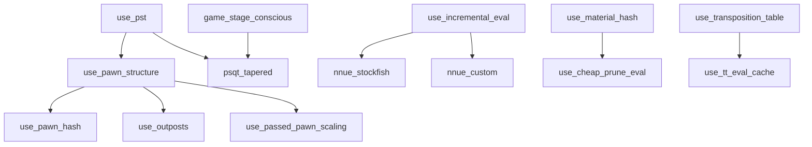

# Development Guide

## Branching Model

```
feature/*  →  dev  →  main (prod)
```

- **`feature/*`** — all day-to-day work happens here
- **`dev`** — integration branch; PRs from feature branches merge here
- **`main`** — production; only `dev → main` PRs, gated by benchmark comparison + sanitizers

## Quick Start

```bash
# Install everything (Python deps + C++ extension, editable):
uv sync --group dev

# Run the default CI gate locally (lint + types + fast tests):
uv run nox

# Run the full test suite:
uv run nox -s tests_all

# Run just one category:
pytest tests/search -v
```

## Build System

The C++ extension is built with **scikit-build-core** + **CMake** (replaced the legacy `setup.py`).

| File                              | Role                                                                 |
| --------------------------------- | -------------------------------------------------------------------- |
| `pyproject.toml` `[build-system]` | Declares `scikit-build-core` + `pybind11` as build deps              |
| `CMakeLists.txt`                  | Compiles `moray_core` pybind11 module from `src/engine/_cpp/` |

### How it works

- `uv sync --group dev` triggers an **editable inplace build**: CMake compiles the `.so` directly into `src/engine/_core/`.
- A `.pth` file adds `/workspace/src` to `sys.path`, so imports use `from engine._core import moray_core`.
- For wheel builds (non-editable), CMake's `install()` places the `.so` in the wheel at `engine/_core/`.

### Rebuilding after C++ changes

```bash
uv sync --group dev   # re-runs CMake inplace
```

### Import convention

All imports use `engine.*` (not `src.engine.*`). The `src/` is a layout directory, not part of the package name.

## Running Tests

### Via Nox (recommended — mirrors CI)

| Command                    | What it runs                             |
| -------------------------- | ---------------------------------------- |
| `uv run nox`               | Default: `lint` + `types` + `tests_fast` |
| `uv run nox -t safe`       | All fast sessions                        |
| `uv run nox -t heavy`      | Full tests + benchmarks + sanitizers     |
| `uv run nox -s tests_fast` | unit + smoke + search + evaluators       |
| `uv run nox -s tests_full` | parity + chess puzzles                   |
| `uv run nox -s tests_all`  | Everything                               |
| `uv run nox -s syzygy`     | Download 3-4-5 piece Syzygy tablebases   |
| `uv run nox -s benchmarks` | Full benchmarks with JSON + autosave     |
| `uv run nox -s sanitizers` | Recompile C++ with ASAN, run tests       |

### Via pytest directly

```bash
pytest tests/unit tests/search -v          # fast subset
pytest tests/ -v                           # everything
pytest tests/chess -v                      # just puzzles
pytest -m "not benchmark and not slow" -v  # skip slow stuff
pytest tests/benchmarks --benchmark-only   # benchmarks only
```

### Markers

Tests are auto-tagged by directory (see `tests/conftest.py`). Registered markers:

| Marker      | Applied to          | Purpose                         |
| ----------- | ------------------- | ------------------------------- |
| `slow`      | `tests/smoke/`      | Longer-running smoke tests      |
| `benchmark` | `tests/benchmarks/` | pytest-benchmark tests          |
| `parity`    | `tests/parity/`     | C++ vs python-chess correctness |
| `chess`     | `tests/chess/`      | Puzzle / tactic correctness     |

Use `-m` to filter: `pytest -m "not slow and not benchmark"`.

## Test Directory Structure

```
tests/
├── conftest.py              ← shared fixtures, auto-marker hook
├── helpers.py               ← test utilities (not collected)
│
├── unit/                    ← fast, isolated, no search
│   ├── test_config_robustness.py
│   ├── test_config_deps.py        ← config dependency validation
│   └── test_core_engine.py
│
├── search/                  ← minimax, TT, zobrist, ordering
│   ├── test_minimax.py
│   ├── test_move_ordering.py
│   ├── test_transposition_table.py
│   └── test_zobrist.py
│
├── evaluators/              ← component & factory tests
│   ├── conftest.py          ← evaluator fixtures
│   └── test_pst_tables.py
│
├── chess/                   ← puzzle / tactics framework
│   ├── conftest.py          ← load_fen_file() helper
│   ├── data/
│   │   └── mate_in_1.fen
│   └── test_mate_puzzles.py
│
├── parity/                  ← C++ board vs python-chess
│   ├── data/fens.txt
│   ├── data/golden/         ← regression snapshots
│   ├── test_golden.py
│   ├── test_legal_moves.py
│   └── test_random_games.py
│
├── benchmarks/              ← persistent benchmarks
│   ├── infrastructure.py
│   ├── test_performance.py
│   └── test_search_metrics.py
│
└── smoke/                   ← quick speed gates
    └── test_speed.py
```

### Adding Tests

- Drop a `test_*.py` file in the appropriate directory — the root conftest auto-tags it.
- **New puzzle category:** add a `.fen` file to `tests/chess/data/`, load with `load_fen_file("filename.fen")` from `tests/chess/conftest.py`. Each line: `<FEN> <expected_uci_move>`.
- **New parity regression:** use `pytest-regressions` — golden YAML files live in `tests/parity/data/golden/`.
- **Evaluator architecture** uses a factory pattern: `EvaluatorFactory.create(config.evaluation)` assembles a `CompositeEvaluator` from individual `EvalComponent` objects (Material, PST, PawnStructure, Mobility, KingSafety). The `game_stage_conscious` flag enables phase-aware weighting across all components.

## Benchmarks (Persistent)

Results are saved to `.benchmarks/` at the repo root on every `--benchmark-autosave` run.

```bash
# Run and save a baseline:
pytest tests/benchmarks --benchmark-only --benchmark-autosave

# Compare against a previous run:
pytest tests/benchmarks --benchmark-only --benchmark-compare=0001

# Full benchmark session (JSON output for CI):
uv run nox -s benchmarks
```

In CI:

- **Merges to `dev`** — benchmarks run, results are uploaded as artifacts (90-day retention) and published to a GitHub Pages dashboard.
- **PRs into `main`** — benchmarks run and are compared against the `dev` baseline. The PR **fails if any benchmark regresses >15%**.

## CI/CD Pipeline

Defined in `.github/workflows/ci.yml`. Five gates, progressively stricter:

```
feature/* push     →  Gate 1: lint + types + fast tests
PR into dev/main   →  Gate 2: + full test suite
dev push (merge)   →  Gate 3: + benchmark persistence & dashboard
PR into main       →  Gate 4: + benchmark regression check (fail >15%)
                      Gate 5: + ASAN/UBSAN sanitizers
```

| Gate | Trigger                               | Jobs                                     |
| ---- | ------------------------------------- | ---------------------------------------- |
| 1    | Every push / PR                       | `lint-and-types` → `tests-fast`          |
| 2    | PRs into dev/main, pushes to dev/main | `tests-full`                             |
| 3    | Pushes to `dev` only                  | `benchmarks` (autosave + dashboard)      |
| 4    | PRs into `main` only                  | `benchmark-compare` (fail on regression) |
| 5    | PRs into `main` only                  | `sanitizers` (ASAN/UBSAN)                |

Duplicate runs on the same ref are cancelled automatically via `concurrency`.

## Syzygy Endgame Tablebases

The engine ships a download script for **3-4-5 piece Syzygy tablebases** (~1 GB).
These files are **not stored in Git** — they are downloaded on-demand from the
[Lichess open-source mirror](https://tablebase.lichess.ovh/) and cached locally.

### Quick Start (Local)

```bash
# Download tables to the default location (data/syzygy/):
python scripts/download_syzygy.py

# Or use nox:
uv run nox -s syzygy

# Download to a custom path:
python scripts/download_syzygy.py --path /mnt/ssd/syzygy

# Override via environment variable:
export SYZYGY_PATH=/mnt/ssd/syzygy
python scripts/download_syzygy.py

# Verify existing tables without downloading:
python scripts/download_syzygy.py --verify-only
```

### How It Works

| Component                    | What it does                                                                                     |
| ---------------------------- | ------------------------------------------------------------------------------------------------ |
| `scripts/download_syzygy.py` | Scrapes the Lichess mirror, downloads missing files with parallel workers, validates sizes       |
| `SYZYGY_PATH` env var        | Overrides the default `data/syzygy/` path used by the script and `constants.DEFAULT_SYZYGY_PATH` |
| `.gitignore` entry           | `data/syzygy/` is excluded from version control                                                  |

### Path Resolution Order

1. **Explicit argument** - `--path` flag
2. **`SYZYGY_PATH` environment variable**
3. **Project default** - `data/syzygy/`

### In CI (GitHub Actions)

The `tests-all` job in `.github/workflows/ci.yml` uses `actions/cache@v4` to
persist the `data/syzygy/` directory across runs. On a cache miss, the download
script runs automatically. The cache key is `syzygy-3-4-5-v1` — bump to `v2`
if you ever change the file set.

## Nox Sessions

All sessions use `uv` as the venv backend. The shared `_install()` helper runs `uv sync --frozen --group dev`.

| Session            | Tag   | Description                                    |
| ------------------ | ----- | ---------------------------------------------- |
| `lint`             | safe  | ruff check + format, clang-format on C++       |
| `types`            | safe  | mypy on `src/`, `noxfile.py`                   |
| `tests_fast`       | safe  | unit, smoke, search, evaluators                |
| `benchmarks_smoke` | safe  | Single benchmark file, 1 round                 |
| `tests_full`       | heavy | parity, chess                                  |
| `tests_all`        | heavy | Entire `tests/` directory                      |
| `syzygy`           | heavy | Download 3-4-5 piece Syzygy endgame tablebases |
| `benchmarks`       | heavy | All benchmarks, JSON output, autosave          |
| `sanitizers`       | heavy | Rebuild C++ with ASAN, run unit+smoke+search   |

## Elo Benchmarking & CI Integration

Moray includes automated Elo estimation against Stockfish 18.

### Running Matches Locally
```bash
# Run a 60-game match against Stockfish 18 (1700 Elo) at depth 5
uv run python scripts/match_stockfish.py --elo 1700 --pairs 30 --depth 5
```

### GitHub Actions Hybrid Elo Model
- **`elo-test` PR Label**: Add the `elo-test` label to any Pull Request. The CI runner will execute a Stockfish 18 benchmark match and post a formatted markdown comment on the PR with win/draw/loss counts, score %, relative Elo difference, and 95% confidence intervals.
- **`workflow_dispatch`**: Trigger a custom match on demand from the GitHub Actions UI with configurable opponent Elo rating, game counts, and search depth.
- **Main Release Certification**: Merging to `main` runs full sanitizers (ASAN/UBSAN) and the release Elo certification campaign.

## Zobrist Hashing

Zobrist hashing is implemented entirely in C++ (`src/engine/_cpp/zobrist_keys.hpp`) and exposed to Python via pybind11 as `moray_core.Zobrist`.

- Keys are generated at **compile time** using a `constexpr` SplitMix64 PRNG seeded from a fixed constant - no runtime initialization cost.
- Tables are **cache-aligned** (`alignas(64)`) for L1 performance.
- `hash_board(board)` - full board re-hash (used after `set_fen`).
- `make_move_hash(board, move)` - O(1) incremental hash for a move (does not push the move).
- `make_null_move_hash(board)` - O(1) incremental hash for a null move (toggles side-to-move and removes en-passant square).
- `get_current_hash()` / `set_current_hash(h)` - read/write the stored hash value.

The Python wrapper lives in `src/engine/search/zobrist.py` and simply re-exports `Zobrist = moray_core.Zobrist`.

Microbenchmarks are in `scripts/bench_zobrist.py`:

```bash
uv run python scripts/bench_zobrist.py
```

## Config System

`EngineConfig` wraps `SearchConfig` + `EvaluationConfig`. Key design decisions:

- **Minimax and IDDFS are always on** — no toggle flags.
- **Zobrist hashing + transposition table** are combined under `use_transposition_table`.
- Config validates dependencies on construction (`__post_init__`). For example, `use_pvs=True` requires `use_alpha_beta=True`, `use_killer_moves=True` requires `use_move_ordering=True`, etc.
- `ConfigSolver` performs a comprehensive validation pass (driven by `ConfigSolverRules`) before the engine is constructed, raising `ConfigSolverError` on violations.

### Supported Configuration Matrix

Canonical inventory of evaluator and search feature surfaces. Any config used in
`configs/` or tests must map to a **Supported** row. The `Depends on` column lists
hard prerequisites — these are the entries that belong in a single config registry so
validation and normalisation can be derived from one source of truth instead of being
hand-maintained in `ConfigSolverRules`.

Status legend: **Supported** = implemented today · **Planned** = on the roadmap ·
**Proposed** = candidate, not yet scheduled.

#### 1. Evaluation backends (exactly one active)

The evaluator is a single swappable backend. Component flags in §2 apply only to the
`classic` / `psqt_tapered` backends; `piece_count`, `random_piece`, and the NNUE
backends replace the hand-crafted sum entirely. See `docs/EVALUATION_PLAN.md` for the
full compositional rules (which options are mutually exclusive vs. stackable).

| Backend | Config key(s) | Depends on | Cost / node | Incremental | Status |
| --- | --- | --- | --- | --- | --- |
| Classic hand-crafted | `evaluation.backend=classic` + §2 | — | low–medium | optional | Supported |
| Piece count (baseline) | `evaluation.backend=piece_count`, `piece_count_weight` | — | very low | no | Proposed |
| Random piece (baseline) | `evaluation.backend=random_piece`, `random_seed` | — | very low | no | Proposed |
| Tapered PSQT (PeSTO) | `evaluation.backend=psqt_tapered` | `pst_source`, `game_stage_conscious` | low | yes | Planned |
| Stockfish NNUE | `evaluation.backend=nnue_stockfish`, `nnue_path` | SF-format network loader, incremental accumulator | low | required | Proposed |
| Custom NNUE | `evaluation.backend=nnue_custom`, `nnue_path` | own architecture + training pipeline, incremental accumulator | low | required | Proposed |

`material` is the degenerate `classic` case (all components off). `classic` is what
`EvaluatorFactory` builds today. NNUE inference must run in C++ — a per-node Python or
Torch call is not viable inside negamax.

PST table source is a sub-option of the hand-crafted backends, mutually exclusive:
`evaluation.pst_source = handcrafted | stockfish_distilled | pesto`. See
`docs/EVALUATION_PLAN.md` §4 for the distillation method and §9 for code vs. network
licensing (Stockfish code is GPL-3.0; its NNUE networks are CC0-1.0).

#### 2. Hand-crafted evaluation components (classic backend)

| Component | Config key | Depends on | Cost / node | Status |
| --- | --- | --- | --- | --- |
| Material | *(always on)* | — | very low | Supported |
| Piece-Square Tables (mg/eg) | `evaluation.use_pst` | — | low | Supported |
| Pawn structure | `evaluation.use_pawn_structure` | `use_pst` | medium | Supported |
| Mobility | `evaluation.use_mobility` | — | medium | Supported |
| King safety | `evaluation.use_king_safety` | — | medium | Supported |
| Game-stage interpolation | `evaluation.game_stage_conscious` | any phase-aware component | low | Supported |
| Bishop pair | `evaluation.use_bishop_pair` | — | very low | Proposed |
| Rook on open/semi-open file | `evaluation.use_rook_open_file` | — | low | Proposed |
| Space | `evaluation.use_space` | — | low | Proposed |
| Threats / attacked pieces | `evaluation.use_threats` | — | medium | Proposed |
| Outposts | `evaluation.use_outposts` | `use_pawn_structure` | low | Proposed |
| Passed-pawn scaling | `evaluation.use_passed_pawn_scaling` | `use_pawn_structure` | low | Proposed |
| Material imbalance | `evaluation.use_material_imbalance` | — | low | Proposed |
| Tempo bonus | `evaluation.tempo_cp` | — | negligible | Proposed |
| Drawishness / contempt | `evaluation.contempt_cp` | — | negligible | Proposed |

#### 3. Per-node evaluation infrastructure (cross-cutting)

| Mechanism | Config key | Depends on | Purpose | Status |
| --- | --- | --- | --- | --- |
| Pawn hash table | `evaluation.use_pawn_hash` | `use_pawn_structure` | cache the pawn-structure term | Proposed |
| Material hash table | `evaluation.use_material_hash` | — | cache material + PSQT base | Proposed |
| Evaluation cache | `evaluation.use_eval_cache` | — | reuse eval by position key | Proposed |
| Lazy / staged eval | `evaluation.use_lazy_eval` | — | cheap score first, refine only in-window | Proposed |
| Incremental accumulator | `evaluation.use_incremental_eval` | push/pop hooks in search | O(Δ) per-node eval | Planned |
| Tuned weights | `evaluation.weights_path` | — | Texel/SPSA-fitted terms | Planned |
| Fixed-point (int) eval | `evaluation.use_int_eval` | — | deterministic, fast arithmetic | Proposed |
| SIMD / batched eval | `evaluation.use_simd_eval` | C++ vectorisation | amortise feature extraction | Proposed |

#### 4. Search-time use of the static eval

| Mechanism | Config key | Depends on | Status |
| --- | --- | --- | --- |
| Leaf / QS stand-pat eval | *(always on)* | evaluator backend | Supported |
| Cheap eval for prune margins (RFP/futility) | `search.use_cheap_prune_eval` | material hash | Proposed |
| TT eval caching | `search.use_tt_eval_cache` | `use_transposition_table` | Proposed |

#### 5. Search feature surfaces

Only the following feature surfaces are supported and should be used in configs/tests.

| Feature                                   | Config key(s)                                                      |
| ----------------------------------------- | ------------------------------------------------------------------ |
| Hash Move Ordering                        | `search.use_hash_move_ordering`                                    |
| MVV-LVA                                   | `search.use_mvv_lva`                                               |
| Static Exchange Evaluation (SEE) Ordering | `search.use_see_ordering`                                          |
| Killer Heuristic                          | `search.use_killer_moves`                                          |
| History / Countermove Heuristics          | `search.use_history_heuristic`, `search.use_countermove_heuristic` |
| Principal Variation Search (PVS)          | `search.use_pvs`                                                   |
| Aspiration Windows                        | `search.use_aspiration_windows`                                    |
| Internal Iterative Deepening (IID)        | `search.use_iid`                                                   |
| Late Move Reductions (LMR)                | `search.use_lmr`                                                   |
| Check Extensions                          | `search.use_check_extensions`                                      |
| Null Move Pruning (NMP)                   | `search.use_null_move_pruning`                                     |
| Futility Pruning (Standard)               | `search.use_futility_pruning`                                      |
| Futility Pruning (Extended)               | `search.use_extended_futility_pruning`                             |
| Futility Pruning (Reverse)                | `search.use_reverse_futility_pruning`                              |
| Delta Pruning                             | `search.use_delta_pruning`                                         |
| SEE in Quiescence Search                  | `search.use_see_pruning_in_qs`                                     |
| TT Aging / Eviction                       | `search.use_tt_aging`                                              |

Note: foundational toggles such as `search.use_alpha_beta`, `search.use_move_ordering`, `search.use_transposition_table`, and `search.use_quiescence_search` remain first-class because they are dependencies for multiple listed features.

#### Evaluation dependency graph



#### Recommended implementation order

1. **Tapered PSQT** backend — highest accuracy-per-effort, no `Evaluator` interface change.
2. **Pawn + material hash** and **lazy eval** — reduce per-node cost without changing the contract.
3. **Incremental accumulator** — prerequisite for any NNUE backend; add a `go(board)` differential test.
4. **Stockfish NNUE** backend — reuse an SF-format network loader plus int8 inference.
5. **Custom NNUE** backend — own architecture and training pipeline.

## C++ Board API Notes

The C++ board (`engine._core.moray_core`) differs from python-chess in a few ways:

| python-chess                    | C++ Board                     | Notes                                           |
| ------------------------------- | ----------------------------- | ----------------------------------------------- |
| `chess.Board("fen")`            | `chess.Board.from_fen("fen")` | Constructor doesn't accept FEN                  |
| `board.turn == chess.WHITE`     | `bool(board.turn)`            | `turn` is `bool` (True=white), not a Color enum |
| `chess.D4`                      | `27` (int)                    | No named square constants                       |
| `board.legal_moves` (generator) | `board.legal_moves` (list)    | Already a list, don't call it                   |
| `str(move)` → `"e2e4"`          | `move.uci()` → `"e2e4"`       | `str()` gives `<Move e2e4>`                     |
| `board.pieces(PAWN, WHITE)`     | `board.pieces(PAWN, WHITE)`   | Returns list of square ints                     |
| `chess.square(file, rank)`      | `rank * 8 + file`             | No `square()` helper                            |

## Tool Configuration

All tool config lives in `pyproject.toml` (single source of truth):

- **Ruff** — `[tool.ruff]` and `[tool.ruff.lint]` (replaces deleted `ruff.toml`)
- **Mypy** — `[tool.mypy]`
- **Pytest** — `[tool.pytest.ini_options]` (strict-markers, coverage)
- **Benchmark** — `[tool.pytest.ini_options.benchmark]`

Dev dependencies use PEP 735 dependency groups: `[dependency-groups] dev = [...]`.

## Pre-commit

`.pre-commit-config.yaml` runs:

- `ruff` (check + format)
- `clang-format` (C++ files)
- `pre-commit-hooks` (trailing whitespace, EOF fixer, YAML check, large file check)

Install: `pre-commit install`. Runs automatically on `git commit`.
